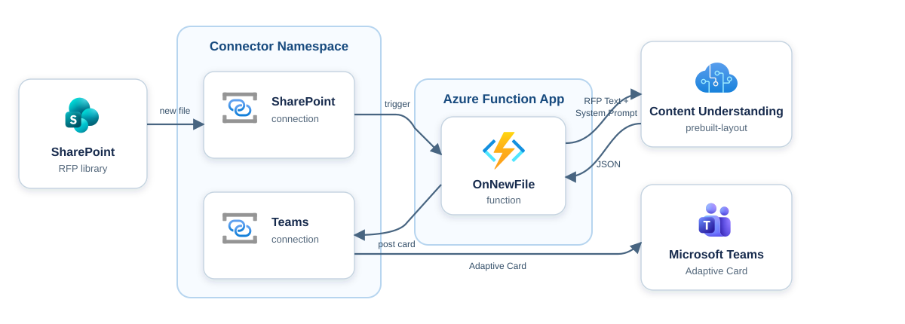

# Automated RFP Intake with SharePoint, Content Understanding, and Teams

> A customer submits an RFP document to a shared SharePoint library. An Azure
> Function picks it up, Azure Content Understanding in Foundry Tools extracts
> its text and layout, deterministic routing rules identify the required
> capabilities, and a summary card is posted to a Microsoft Teams channel.

This .NET sample shows how to implement the scenario above using the
[Azure Functions Connector extension](https://github.com/Azure/azure-functions-connector-extension)
and the
[Azure Connectors .NET SDK](https://github.com/Azure/Connectors-NET-SDK). It
uses two connections, SharePoint Online and Microsoft Teams, created in an
[Azure Connector Namespace](https://learn.microsoft.com/azure/connector-namespace/connector-namespace-overview),
and leverages the function app's managed identity for authentication.



## Prerequisites

- [Azure Developer CLI (`azd`)](https://learn.microsoft.com/azure/developer/azure-developer-cli/install-azd)
- [Azure CLI (`az`)](https://learn.microsoft.com/cli/azure/install-azure-cli) ≥
  2.75.0
- [Azure Functions Core Tools](https://learn.microsoft.com/azure/azure-functions/functions-run-local?tabs=macos%2Cisolated-process%2Cnode-v4%2Cpython-v2%2Chttp-trigger%2Ccontainer-apps&pivots=programming-language-csharp#install-the-azure-functions-core-tools)
  for local development.
- [.NET 10 SDK](https://dotnet.microsoft.com/download)
- [Azurite](https://learn.microsoft.com/azure/storage/common/storage-use-azurite)
  for local development.
- [`jq`](https://jqlang.org/download/) (macOS and Linux only)
- [`connector-namespace` Azure CLI extension](https://github.com/Azure/Connectors/tree/main/public-preview/connector-namespace-cli)
- [Visual Studio Code](https://code.visualstudio.com/) for local development
  with a dev tunnel.
- A SharePoint site + document library to receive RFPs.
- RFPs with a `Customer`, `Client`, or `Organization` field and a numbered
  `Required Capabilities` section. The included sample demonstrates the
  expected structure.
- A Microsoft Teams **team** and **standard or private channel** to post to.
  The deployed end-to-end workflow has been verified with a private channel.
  The Teams **Workflows** app must be allowed in the
  [Teams admin center](https://admin.teams.microsoft.com/policies/manage-apps)
  (required by the card-posting action). See the
  [Microsoft Teams connector documentation](https://learn.microsoft.com/connectors/teams/?tabs=text1%2Cdotnet)
  for details.

## Deploy and test in Azure

1. Clone the repo:

   ```pwsh
   git clone https://github.com/Azure-Samples/functions-connectors-net-rfp-intake-sharepoint-teams.git
   cd functions-connectors-net-rfp-intake-sharepoint-teams
   ```

2. Log in to Azure:

   ```pwsh
   azd auth login
   az login
   ```

3. Inside the root directory, create an `azd` environment. Its name is used to
   derive the resource group and resource names:

   ```pwsh
   azd env new rfp-demo
   ```

4. If you don't know the Teams IDs, list the teams you have joined:

   ```pwsh
   az rest --method get --url "https://graph.microsoft.com/v1.0/me/joinedTeams" --query "value[].{name:displayName,teamId:id}" -o table
   ```

   Then use the team ID to list its channels:

   ```pwsh
   az rest --method get --url "https://graph.microsoft.com/v1.0/teams/<team-id>/channels" --query "value[].{name:displayName,channelId:id}" -o table
   ```

5. Provision the resources, deploy the Function App, authorize both connector
   connections, and configure the SharePoint trigger:

   ```pwsh
   azd up
   ```

   During the command, you are prompted for:

   - **Azure Subscription** (`00000000-0000-0000-0000-000000000000`):
     subscription where the resources will be provisioned.
   - **Location** (`East US 2`): Azure region where resources will be
     deployed. The deployment limits this prompt to regions supported by
     Content Understanding.
   - **`SHAREPOINT_SITE_URL`**
     (`https://contoso.sharepoint.com/sites/RFPs`): SharePoint site that
     contains the document library to monitor.
   - **`SHAREPOINT_LIBRARY_NAME`** (`Documents`): SharePoint document
     library that contains the RFP files. This is not a folder name.
   - **`TEAMS_TEAM_ID`** (`00000000-0000-0000-0000-000000000000`):
     Microsoft 365 group ID of the team that receives the summary card.
   - **`TEAMS_CHANNEL_ID`** (`19:example-channel-id@thread.tacv2`):
     channel ID within the team that receives the summary card.

   The platform-specific `authorize-connections` script opens a browser for
   the SharePoint and Teams OAuth consent flows. On each page, select **I have
   verified this request and trust the source**, then select **Allow access**.
   Connections that are already authenticated are skipped. The post-provision
   hook then generates `local.settings.json` for optional local development.

6. Upload `sample-data/contoso-rfp.pdf` to the monitored SharePoint library.
   Use a new file name if the sample was uploaded previously because the trigger
   listens for newly created files.
7. Allow up to five minutes for the SharePoint trigger to detect the file. A
   **"New RFP received"** Adaptive Card appears in your Teams channel:

   ```text
   📄 New RFP received
   Customer:      Contoso Ltd.
   Source file:   contoso-rfp.pdf

   Required capabilities
   - Azure AI
   - Data Platform
   - Identity & Security
   - Integration & Automation
   - Observability & Operations

   Recommended SMEs
   - AI Specialist
   - Data Platform Engineer
   - Security Architect
   - Integration Architect
   - Cloud Operations Specialist
   ```

   The `prebuilt-layout` analyzer supports PDF, image, Microsoft Office, HTML,
   email, and text-based documents. Content Understanding performs OCR and
   layout extraction; the application then uses explicit, testable rules to
   parse the customer and numbered capability headings and map them to SME
   roles. This analyzer does not require a language or embedding model.

## Run automated tests

Run the offline parser and SharePoint-content decoding tests:

```pwsh
dotnet test tests/RfpApp.Tests/RfpApp.Tests.csproj --filter "Category!=Integration"
```

To verify the included PDF against the provisioned Microsoft Foundry resource,
sign in with `az login`. `azd provision` grants the provisioning identity the
`Cognitive Services User` role.

PowerShell:

```pwsh
$env:CONTENT_UNDERSTANDING_ENDPOINT = azd env get-value contentUnderstandingEndpoint
dotnet test tests/RfpApp.Tests/RfpApp.Tests.csproj --filter "Category=Integration"
```

macOS or Linux:

```sh
export CONTENT_UNDERSTANDING_ENDPOINT="$(azd env get-value contentUnderstandingEndpoint)"
dotnet test tests/RfpApp.Tests/RfpApp.Tests.csproj --filter "Category=Integration"
```

If you test against a different account, set its endpoint manually and grant
your identity the `Cognitive Services User` role first.

## Run locally

Local execution still uses the connector connections and Content Understanding
resource provisioned in Azure. If you haven't run `azd up`, run `azd provision`
and complete both connector consent flows first.

1. The post-provision hook creates `local.settings.json` from
   `local.settings.example.json` and fills in the connector runtime URLs,
   SharePoint site, Teams destination, and Content Understanding endpoint. It
   leaves `AZURE_CLIENT_ID` empty so `DefaultAzureCredential` uses your local
   Azure sign-in instead of the Function App's managed identity.

   To regenerate the file after changing environments or provisioning values,
   run:

   ```pwsh
   pwsh ./infra/scripts/createlocalsettings.ps1 -Force
   ```

   On macOS or Linux:

   ```sh
   sh ./infra/scripts/createlocalsettings.sh --force
   ```

2. Start Azurite in a separate terminal:

   ```pwsh
   azurite --silent --location ~/.azurite/connectors-sample
   ```

3. Start the app with authentication enabled:

   ```pwsh
   func start --enableAuth
   ```

   Always use `--enableAuth` when exposing the app through a dev tunnel.
   Without it, the function endpoint is unauthenticated on the public internet.

4. In VS Code, open the **Ports** view, select **Forward a Port**, and enter
   `7071`.
5. Copy the generated **Forwarded Address**, such as
   `https://<id>-7071.uks1.devtunnels.ms`. Right-click port `7071`, select
   **Port Visibility → Public**, and confirm the warning.
6. Point the SharePoint trigger to the local Function host.

   On macOS or Linux:

   ```sh
   sh ./infra/scripts/configure-trigger.sh \
     --target local \
     --callback-base-url "https://<id>-7071.uks1.devtunnels.ms"
   ```

   On Windows:

   ```powershell
   pwsh ./infra/scripts/configure-trigger.ps1 `
     -Target Local `
     -CallbackBaseUrl "https://<id>-7071.uks1.devtunnels.ms"
   ```

7. Upload a newly named copy of `sample-data/contoso-rfp.pdf` to SharePoint.
   The trigger polls every five minutes and sends the callback through the
   public dev tunnel. Rerun the configuration command whenever the forwarded
   address changes.

To return the trigger to the deployed Function App, run `azd deploy`. The
`postdeploy` hook recreates the trigger with the Azure callback URL.

## How the workflow works

1. **RFP arrives.** A file is uploaded to the monitored SharePoint document
   library.
2. **Trigger.** The Connector Namespace polls the SharePoint **"When a file
   is created"** trigger (`GetOnNewFileItems`) and calls the function's
   `OnNewFile` callback. The trigger returns properties only, so the content
   must be fetched separately.
3. **Fetch content.** The function calls the SharePoint **"Get file content"**
   action (`SharePointOnlineClient.GetFileContentAsync`) with the file
   identifier from the trigger payload and decodes the connector's JSON Base64
   binary response into the original document bytes.
4. **Extract the document.** The original file bytes are sent to Content
   Understanding's `prebuilt-layout` analyzer, which returns OCR text and
   document structure without invoking a generative model.
5. **Route the RFP.** The function parses the customer and numbered headings in
   the `Required Capabilities` section, then maps recognized capability terms
   to SME roles with deterministic routing rules.
6. **Notify.** The function builds an Adaptive Card and posts it to a Teams
   channel with the **"Post card in a chat or channel"** action
   (`TeamsClient.PostCardToConversationAsync`).

## Upgrade or clean up

If you previously provisioned an Azure OpenAI or standalone Document
Intelligence version of this sample into the same azd environment, incremental
ARM deployment retains those unused Cognitive Services accounts. After the
Content Understanding workflow is deployed and verified, list the legacy
accounts:

```pwsh
az cognitiveservices account list --resource-group "$(azd env get-value resourceGroupName)" --query "[?kind=='OpenAI' || kind=='FormRecognizer'].{name:name,kind:kind}" -o table
```

If the command returns an account, confirm that no other application uses it,
then delete the unused resource:

```pwsh
az cognitiveservices account delete --resource-group "$(azd env get-value resourceGroupName)" --name <legacy-openai-account-name>
```

To delete the complete sample environment instead:

```pwsh
azd down --purge
```

## How auth works (no secrets)

- **Function-app user-assigned managed identity:** Calls the SharePoint and
  Teams connection runtime URLs and Azure Content Understanding. It has an
  access policy on each connection and the `Cognitive Services User` role on
  the Microsoft Foundry resource.
- **Application Insights:** The Function worker uses the same managed identity
  to export OpenTelemetry. Local authentication is disabled on the Application
  Insights and Microsoft Foundry resources.
- **Connector Namespace system managed identity:** Polls the SharePoint
  trigger and delivers callbacks.
- **Callback authorization:** Uses the `connector_extension` system key on the
  callback URL. This sample does not use App Service built-in authentication.

## Deployment scripts

The scripts in `infra/scripts` complete setup that cannot be handled entirely by
the Bicep deployment:

- **`authorize-connections.ps1` / `.sh`:** Opens the OAuth consent flow and
  waits for the SharePoint and Teams connections to become authenticated.
  Connections that are already authenticated are skipped. This script is
  needed because Bicep creates the connections, but a user must grant consent.
- **`createlocalsettings.ps1` / `.sh`:** Generates the ignored
  `local.settings.json` file from the committed example and the current azd
  deployment outputs. It preserves an existing file unless explicitly forced.
- **`postprovision.ps1` / `.sh`:** Runs connector authorization and local
  settings generation. `azd provision` invokes this platform-specific script
  through the `postprovision` hook.
- **`configure-trigger.ps1` / `.sh`:** Creates the SharePoint new-file trigger
  and points it to a local dev tunnel or the deployed Function App. It adds the
  `connector_extension` system key to the callback URL. This script runs after
  the function is available because the callback URL and key are not known
  earlier. Changing targets requires the trigger to be deleted and recreated.
- **`postdeploy.ps1` / `.sh`:** Configures the trigger for Azure and checks
  both connection authorizations. `azd deploy` runs the platform-specific
  script through the `postdeploy` hook, replacing any local callback with the
  deployed Function App callback.

## Troubleshooting

If the summary card is not posted to the specified Teams channel, check the
following:

- In the Connector Namespace portal, verify that the SharePoint trigger's
  callback URL points to the intended local dev tunnel or deployed Function App
  and includes the correct `connector_extension` access key.
- For local testing, verify that port `7071` is forwarded and the dev tunnel
  visibility is **Public**.
- Ensure Azurite is running before starting the function locally and configuring
  the trigger.
- Allow up to five minutes for the SharePoint trigger to detect a newly created
  file. Each new test upload produces another Teams post.
- Leave `AZURE_CLIENT_ID` empty in `local.settings.json` for local development.
  The Function App's managed identity client ID is only needed when running in
  Azure.
- Confirm the Teams connection was authorized by a user who can access the
  destination team and channel. Private channels are supported when that user
  is a channel member.
- Confirm the uploaded file is in a
  [format supported by Content Understanding](https://learn.microsoft.com/azure/ai-services/content-understanding/service-limits#input-file-limits).
- Confirm the RFP contains a numbered `Required Capabilities` section. The
  deterministic parser intentionally returns empty capability and SME lists
  rather than inventing requirements that are not present.

## Resources

- [Azure Functions Connector extension](https://github.com/Azure/azure-functions-connector-extension)
  — the trigger binding used here.
- [Azure Connectors .NET SDK](https://github.com/Azure/Connectors-NET-SDK) —
  typed clients for SharePoint, Teams, and other connectors.
- [Azure Content Understanding `prebuilt-layout` analyzer](https://learn.microsoft.com/azure/ai-services/content-understanding/concepts/prebuilt-analyzers#prebuilt-layout)
  — non-generative OCR and layout extraction used by this sample.
- [Content Understanding region support](https://learn.microsoft.com/azure/ai-services/content-understanding/language-region-support)
  — regions available for the Microsoft Foundry resource.
